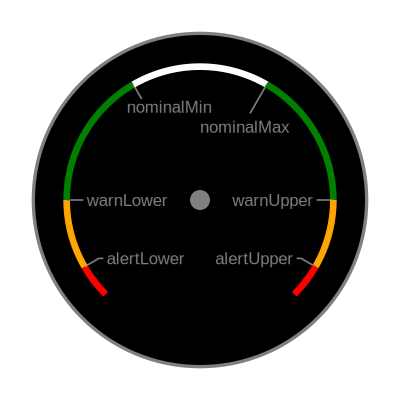

# Ortac Standard

## Version 
```txt mdpInsert fsnip ./package.json --from "'version\": \"'" --to "'\"'"
0.1.1
```

## Contents
- [Introduction](#ref-introduction)
  - [Terminology](#ref-terminology)
  - [Hardware](#ref-hardware)
    - [Servers](#ref-servers)
    - [Device Clients](#ref-device-clients)
    - [Display Clients](#ref-display-clients)
- [Ortac Messaging Standard](#ref-messaging-standard)
  - [Principles]
    - [Measurements]
    - [Units]
    - [Quantity Kinds]
    - [Calculated Measurements]
    - [Timestamps]
    - [Dual Sources]
  - [MQTT Payload Formats]
  - [MQTT Topics]
  - [Functional Specification]
  - [Display of Data]
    - [Introduction]
    - [Display Zones]
    - [Display Hierarchy]
  - [Bridging to an upstream server]
  - [AIS and RADAR targets]
  - [Manufacturer provided data]
  - [Language]
    - [Translation]
- [Designing Displays]

<a id="ref-introduction"></a>
# Introduction

The Ortac (Marine Internet of Things) Standard consists of a hardware and messaging standard designed for connecting sensors and displays in vessels. The Messaging standard is defined separately to the Hardware standard.

The objectives of the Standards are to create devices which:

- are reliable and easy to set up by non technical users
- guarantee interoperability between products from different manufacturers
- have low or no fees for implementing the standard
- are published and maintained as open source
- produce reliable and consistent display and presentation of data
- have a security model built in
- allow for redundant hardware capability at all levels (servers, sensors, displays)
- are multilingual

In deciding upon design requirements the following principles should be considered:

- minimize or eliminate optional requirements which would in effect be mandatory for equipment requiring maximum interoperability
- where there is a choice of methodologies choose the one which has the widest use case whilst retaining simplicity

## Terminology

This standard uses standardised terminology throughout where the following words have the meanings specified here:

- *quantity* : as defined in VIM*. Examples are Depth, Distance, Temperature, Capacity
- *quantityKind*: per 'kind of quantity' as defined in VIM*. Examples are length, temperature, mass
- *value*: per 'quantity value' as defined in VIM*, or a value for a *property* or *ordinal*. Examples are 12.2m, 14.3Nm, 21.2K, 152Kg, On, 49.12234°N 2.15345°W
- *unit*: per 'measurement unit' as defined in VIM*. Examples are meters, Nautical Miles, Kelvin, grams
- *property*: per 'nominal property' as defined in VIM*. Examples are color, vessel type, country code
- *propertyKind*: the kind of, or type of, property. eg. OnOff, RGB12, Position
- *ordinal quantity*, or *ordinal*: per 'ordinal quantity' as defined in VIM*. Examples are the Beaufort scale, sea state.
- *context*: a series of mqtt topic segments providing an identifier for a specific measurement (but not instance specific) eg. propulsion/{engine}/oil
- *specific context*: is a context but with the addition of specific instance information (eg. propulsion/port/oil)
- *data point*: a combination of a *specific context* and *quantity*
- *measurement*: a specific value observed for a *data point* 

*VIM is the International Vocabulary of Metrology

NOTE: In deciding whether something is a quantity, an ordinal quantity or a property the following tests should be applied:

- if the *value* being represented is measured with a scalar and an (optional) unit and is of a continuous nature, it is a quantity.
- if the *value* being represented is numeric in nature but is not continuous then it is an ordinal quantity
- otherwise the *value* is a property

The words *MUST*, *MUST NOT*, *REQUIRED*, *SHALL*, *SHALL NOT*, *SHOULD*, *SHOULD NOT*, *RECOMMENDED*, *MAY*, and *OPTIONAL* are to be interpreted as described in [IETF RFC 2119](https://datatracker.ietf.org/doc/html/rfc2119).

?/
  gearRatio (not the ordinal gear)

property/
  mmsi
  url
  urn
  name
  location (name)
  manufacturer (name)
  model (name)
  country
  port (location)
  imo number
  registration number
  description
  callSign
  phoneNumber
  email
  time/dateTime
  age (of magnetic Variation in seconds) (time passed)
  navLightMode
  route (name?)
  waypoint (name?)
  position (includes accuracy, time and altitude, fix type, GNSS type eg. GPS) maybe position has a meta for all the extra position info?
  navigationState (at Anchor, underway, towing, etc)
  driveType (outdrive, shaft, sailDrive, shaft, waterJet, pod, other, etc)
  fuelType (diesel, petrol, electric, coal/wood, other)
  chemistry (of a battery)
  chargingAlgorithm
  chargingMode
  phase (electrical) (Single, A, B, C or 3 phase
  extinguishant
  
 
ordinal/
  gear (transmission gear)
  POB
  beaufort
  
## Hardware

Ortac hardware types are:

- **servers**: provide MQTT messaging broker (server) services and required Ortac server functionality
- **device clients**: can provide source data (from physical sensors), act as a gateway to other networks/protocols, or control physical devices
- **display clients**: display Ortac data and/or control Ortac (or gateway systems) devices

One or more of these functions may be implemented on one physical device.

### Servers

A Ortac server is an umbrella term for any device which provides one or more of the following Services:

- **Ortac Broker Service**

  This service allows for the transmission of messages on a Publish/Subscribe model.

  The Ortac Broker Service **MUST** meet the the following requirements:
  - implement an MQTT version 5 server supporting:
    - maximum QOS 2
    - retained messages
    - topic aliases
    - wildcard subscriptions
    - TCP/IP TLS
    - websocket

- **Ortac Resource Service**

  This service is an API which allows other **servers**, **device clients**  and **display Clients** to access resources such as valid topics, conversion parameters, etc. from a common source. The central provision of this service means that lightweight devices do not maintain and update lists of these resources themselves.

  The Ortac Resource Service **MUST** implement a RESTful API in compliance with the specification set out below

Each Ortac server also:

**MUST:**
  - implement **at least** one interface which uses either Ethernet **OR** WiFi
  - if a WiFi interface is implemented, **at least** one interface **MUST** be capable of being set up as an access point and **at least** one interface **MUST** be capable of being set up as a station
  - use DHCP if a DHCP server is available for the interface, and if not, use APIPA
  - advertise its capability using DNS Service Discovery (DNS-SD) and mDNS (Bonjour)

**SHOULD:**
- provide a web (HTML) interface for setting up the device

**MAY:**
- allow for a fixed IP address, but this must not be the default (shipped) condition

Whilst a Ortac server is not required to implement both a Ortac Broker Service and a Ortac Resource service on one physical device, it is expected that this be the most common approach. In order for a Ortac system to operate it **MUST** have **at least** one Ortac Broker Service and one Ortac Resource Service operating on the network.

### Device Clients

**MUST** meet the following criteria:
- implement an MQTT 5.0 client conforming to the Ortac Messaging Standard
- use DHCP if a DHCP server is available for the interface, and if not, use APIPA
- automatically connect to an Ortac Broker using DNS Service Discovery (DNS-SD) and mDNS (Bonjour)
- publish data and metadata to an MQTT broker in accordance with the Ortac Messaging Standard
- only publish to ortac/# topics in accordance with this specification

**SHOULD:**
- provide a web (HTML) interface for setting up the device

### Display Clients

**MUST** meet the following requirements:

- implement an MQTT 5.0 client conforming to the Ortac Messaging Standard
- use DHCP if a DHCP server is available for the interface, and if not, use APIPA
- display data with correct units, limits and other display information as defined by the Ortac Messaging Standard
- only publish to ortac/# topics in accordance with this specification

# Ortac Messaging Standard

Implemented on MQTT 5.0 the Ortac Messaging Standard defines how MQTT is used and organised.

## Principles

### Measurements

Measurements can often by combined or separated and to some extent the choice is arbitrary. Ortac seeks to keep each measurement as a single quantity. Some 'measurements' inherently consist of more than one quantity eg. 'position' only makes sense if both latitude and longitude are included. Some measurements are vectors eg. COG/SOG, wind direction/speed. These could logically be held in one vector quantity BUT this is not usually the way mariners present this data. Therefore vector items are split into separate quantities (speed, direction).

### Units

Units for presentation are often a personal preference and the conversion factors are always included so that the user can choose the unit. Note that unit conversion does not alter the quantityKind.

### Quantity Kinds

Quantity Kinds (volume, speed, mass, etc) can sometimes usefully be converted from one to another. The conversion between kinds is provided for where it is static (for a voyage or longer time period). For example tank capacity can be stated as volume, percent or mass and these are all linked by the size of the tank and density of the liquid. Arguably the conversion may be dependent on temperature but this is ignored as is common in practice.

### Calculated Measurements

Calculated measurements are ones in which the value is derived from 2 or more non static measurements. eg. by measuring relative wind and COG/SOG the true wind over the ground can be calculated. The Ortac standard allows sensors to subscribe to topics that allow them to provide calculated fields. These are presented as 'local.calc' calculated values where the source is from more than one device. In addition a server may provide calculations from multiple sources. If one device is the source of all required inputs the Topic would credit that item to `local.ortac` rather then `local.calc`. As a further example COG/SOG are calculated within GPS devices from positions. In this case the GPS device and `local.ortac` is listed as the source as they all come from one device. The logic here is that calculated fields using separate sensors will not be aligned in the time domain and this can lead to errors in the calculation, thus the requirement to highlight calculated fields.

### Timestamps

Ortac does not generally use timestamps. The nature of the pub/sub system means that we assume all measurements are realtime. In most cases this is perfectly acceptable. However there are some instances where this is not appropriate. For example an out of date position report can have safety implications when being used to track other ships. To deal with this and other ship reporting generally, Ortac requires that all topics under .../vessels/... are only populated from devices actually on that vessel. Therefore there will only be multiple vessels listed under 'vessels' in a multiplexing or upstream server. A separate Topic branch ortac/locations/... is used which allows multiple sources to place data there and has measures to ensure the data is the most up to date. TODO need to check whether position is viable without a timestamp. eg. at high speeds could GPS miscompare be picked up - depends on update rate...

### Dual Sources

Where there are dual sources for a particular item Display Devices **MUST** ensure that they display values from one source only. The reason for this is that the 2 different sensors could have slightly different values, eg. sea temperature of 19.2C vs 18.6C. If both were being displayed then the display would continually flip between these 2 values. The display device **MUST** pick one device in preference to the other (either randomly or as part of user set up) and stick to that until a different sensor has significantly improved accuracy. It would be possible for a Display Device to show just one source (as selected by the user) and in the event of it failing actively search for other devices providing the same data. Finally it would also be possible for a Display Device to monitor more than one source (but displaying only one) and warn if there is a miscompare beyond predetermined limits. TESTS: setup multiple sources in test environment to ensure displays don't flip flop.

## Versioning

This specification is versioned using Semantic Versioning as defined at [semver.org](https://semver.org). In summary: MAJOR.MINOR.PATCH where:
1. MAJOR version is incremented when incompatible changes to the specification are made
2. MINOR version is incremented when functionality is added in a backwards compatible manor
3. PATCH is incremented for backward compatible bug fixes

The versioning applies to all parts of this specification as a whole including the Ortac Resource Service and the context specifications. Backwards compatible changes to the ortac-resources (ie principally additions and fixes to contexts, instances, quantities and kinds) are to be regarded as bug fixes.

Within the specification there are parts which have their own versioning. These are:
- locale JSON file format - see ./locale.schema.json for specification
- resource JSON file format - see ./schemas/ortac-resources.schema.json
- resources api version - the version number of the resources api will also be reflected in the version number of api-quantities.schema.json and api-version.schema.json

:::{note}
In the case of the resource JSON file there is a version number for the file format. This is separate to the version number of the contents which will always be the same as the version number of the specification.
:::

:::{note}
Software designed to provide the Ortac Resource Service will be designed to meet a particular MAJOR.MINOR version of this specification and will use the ortac-resources to provide its data. Therefore a PATCH increment to the ortac-resources can be accommodated without needing to change that software. 
:::

## MQTT Payload Formats

The MQTT Payload is always transmitted in Byte Format following one of the layouts listed below. Therefore the MQTT5 `Payload Format Indicator` is omitted from the packet (ie. the default byte format is inferred).

The value transmitted is always in SI units.

In all cases, values and data types are Big-Endian. If there are any additional Bytes after field2 they are a digital signature (see below).

| Format Name | Identifying Bits | payloadScaling | Length (Bytes) | Field 1       | Field 2                    | 'NULL' value   |
| :--         | :--              | :--:           | :--:           | --            | --                         | -:             |
| 1a          | 1                | ✅            |  5             | 28 bit dedupe | 11 bit signed integer      | -1,024         |
| 1b          | 0100             | ✅            |  6             | 28 bit dedupe | 16 bit signed integer      | -32,768        |
| 1c          | 0101             | ✅            |  7             | 28 bit dedupe | 24 bit signed integer      | -8,388,608     |
| 1d          | 0110             | ✅            |  8             | 28 bit dedupe | 32 bit signed integer      | -2,147,483,648 |
| RESERVED    | 0111             |                |                |               |                            |                |
| 2a          | 0010             | ❌            |  8             | 28 bit dedupe | 32 bit IEEE 754-2008 float | NaN            |
| 2b          | 0011             | ❌            | 12             | 28 bit dedupe | 64 bit IEEE 754-2008 float | NaN            |
| 3           | 0001             | ❌            |  4+            | 28 bit dedupe | UTF-8 JSON                 | null           |
| RESERVED    | 0000             |                |                |               |                            |                |

All Ortac devices which send messages **MUST** use one of these payload formats. Each message sent to a particular context **MUST** increment the deduplication counter for each message. The deduplication counter does not have to be contiguous, ie. it **MAY** be incremented by a value greater than 1. This is desirable if a new payloadScale is set with new `dedupeMin` and `dedupeMax` values. 

All Ortac devices which receive messages (ie. Device Clients and Display Clients) **MUST** ignore messages which do not conform to one the these payload formats. They **SHOULD** implement deduplication to ensure the same message routed through different Ortac server(s) is not treated as a separate message. 

:::{note}
  The reserved  formats can be expanded in future by using the next 4 bits to define multiple additional formats if required.
:::

:::{note}
  The reasons for not using the MQTT built in Payload Format Indicator are:
  - the Ortac payload may be digitally signed and/or encrypted. The Payload Format Indicator can only be either UTF-8 or Byte, so we use Byte
  - there is overhead in using MQTT5's built in user properties. In addition the user properties can only be UTF-8 so encoding for example a deduplication counter is inefficient.
  - as some sensors will have fast update rates keeping the byte count of each payload as low as possible reduces network traffic
:::
:::{note}
  The formats above provide choices for the developer of Ortac sensor devices. In general the shortest format which accommodates the data type should be used, particularly when the update rate is higher. However, some data types are not of a linear nature, and are therefore best passed as one of the floating types. Generally the 32 bit float will provide sufficient accuracy for Ortac readings.

  Where an integer type is used, it is useful to center the integer 0 at the must common output value. This means that the majority of values can be passed in format 1a, using the the wider type 1 formats as required when the value is further from the most common output value.
:::

### Format 1

Formats 1 a-d all rely on the passing of a `payloadScaling` object within Meta. This provides scaling information to be applied to the unsigned integer in order to obtain the SI value. Each of the values `factor`, `divisor` and `offset` are optional, and the default values are shown in the table below.

| Name    |      | Default Value |
| ------- | ---- | ------------- |
| factor  |   f  |           1.0 |
| divisor |   d  |           1.0 |
| offset  |   o  |           0.0 |


In order to convert the signed Integer value (i) to the SI value (S) the formula below MUST be used.

S = i * f / d + o

The receiving system SHOULD use a double precision (64 bit) float or higher precision type to perform this calculation.

:::{note}
Allowing for both a Factor and a Divisor is not mathematically required. It is implemented this way so that divisors which are not represented well in Base 10 can be easily used. eg. a divisor of 2048 would have to be described as a factor of 4.8828125e-4
:::

The `dedupeMin` and `dedupeMax` **MUST** be set and the difference between the 2 values **MUST NOT** exceed 2^22 (after allowing for rolling). Their purpose is to match the payloadScaling to the correct values. If the `dedupe` passed in the payload is within `dedupeMin` and `dedupeMax` the conversion can proceed. When the scaling is changed a new set of `dedupeMin` and `dedupeMax` will be set which allow the receiving device to apply the new scaling to the correct received values. Periodically, the payloadScaling will be re-published with a new range of dedupe values. If `dedupeMax` is smaller than `dedupeMin` the payloadScaling still applies to dedupe values >= `dedupeMin` and <= `dedupeMax`, ie via the 28 bit unsigned roll over value.

Ortac receiving devices **MUST** ensure payloads are matched and processed in accordance with `payloadScaling` in the specified deduplication range. Ortac receiving devices **MUST** either discard mismatched payloads, or buffer them for processing against a subsequent matching `payloadScaling` specification. When a new `payloadScaling` specification is received up to 3 previous `payloadScaling` specifications **MAY** be buffered and used to convert matching payloads. Ortac receiving devices **SHOULD** process `payloads` in the order received unless they are only being stored for subsequent processing.

:::{note}
Limiting the range of `dedupeMin` and `dedupeMax` to a maximum of 2^22 has the effect of ensuring there are at least 64 different `payloadScaling` specifications before the dedupe counter rolls. Since only a maximum of 4 (3 buffered plus the latest) `payloadScaling` specifications can be available for use at any one time there is no chance of ambiguity in which `payloadScaling` to use. Theoretically if a device transmitted 65 `payloadScaling` specifications utilising the maximum allowed dedupe range in a very short space of time, and a payload arrived out of order at the device, there could be a conflict. However, in practice new `payloadScaling` specifications are unlikely to be frequently updated. Ortac sending devices may enforce an internal rule to limit the frequency of `payloadScaling` to no more than once per second. This will make any conflict extremely unlikely. 
:::

:::{tip}
It is recommended that Ortac receiving devices buffer at least 1 previous `payloadScaling` specification. This will be sufficient to ensure no payload is dropped, except in extreme circumstances.
:::

:::{tip}
Payload scaling and offset: for example the DS18B20 temperature sensor provides an 11 bit temperature between -55°C and +125°C in 1/8° steps. By choosing an appropriate divisor and offset all values can be sent using format 1a. In this example we've picked an offset near the middle of the possible range of the DS18B20. Therefore, with a payload object of:

```js
"payloadScaling": {
  "divisor": 8.0, // replicates the accuracy of the DS18B20
  "offset": 303.15, // +30°C
  "dedupeMin": 23456,
  "dedupeMax": 100000
}
```
The SI values would be:

| payload (int11)  | SI temp (°K) | Temp (°C) |
| -:               | -:           | -:        |
| 0                | 303.150      |  30.000   |
| 1                | 303.275      |   0.125   |
| 8                | 304.150      |   1.000   |
| -680             | 218.150      | -55.000   |
| 500              | 365.650      |  92.500   |
| 760              | 398.15       | 125.000   |
:::

### Format 2

In each case the float supplied is the SI value. If there are additional bytes present after the float, they are a Digital Signature (see below). In each case any type of NaN or Infinity is interpreted as Null ie. it indicates that no value has been supplied. 

### Format 3

UTF-8 encoded JSON. The JSON MUST be compliant with `ECMA-404`. As such it will never contain the 0x00 (NULL) character. Where the JSON is simply a number it represents the value in SI units. Where the JSON is either zero length or `null`,  that indicates that no value is available. If the 0x00 (NULL) character is present in the payload, all bytes before the NULL are the JSON, and all bytes following the NULL are the digital signature (see below).

### Digital Signature

If present the Digital Signature consists of a single signature type Byte, followed by the signature itself:

TODO - this needs to be completed, the table below is an initial example only.

| Signature Type Byte Value | Signature Type                         | Length (Bytes) |
| :-                        | :-                                     | -:             |
| 0x11                      | DER Encoded ECDSA using 256-bit EC key | 72             |
| 0x21                      | HMAC_MD5                               | 16             |

## MQTT Topics

MQTT Topics are split into several sections:

- **ALL** Ortac topics start with ortac/
- the second level of the Topic is a uri for the individual vessel/aircraft/aton. It is provided by the bridging Ortac server. However for all local (onboard) systems it is blank and is only populated (on the upstream server) when the Bridging onboard Ortac server is bridged to an upstream Ortac server. The uri **MUST** be fully compliant IANA Uniform Resource Name for a vessel as defined [with IANA here](https://www.iana.org/assignments/urn-formal/mrn) eg. urn:mrn:itu:mmsi:299123456, urn:mrn:imo:imo-number:12345678 or urn:uuid:123e4567-e89b-12d3-a456-426655440000. Use urn:uuid only if the vessel doesn't have an mmsi or imo number.
- the third segment is either blank (for onboard sensors, or sys for Ortac system related data
- for onboard devices and measurements the layout is therefore:
  - 2 empty segments `ortac///`
  - the next 3 segments of the Topic consist of information about the source:
    - Ortac Originator Device ID- is a unique identifier for the Ortac hardware device publishing this topic. When the Ortac hardware is an individual application on a general purpose device (eg. an iPhone) the application is considered to be the Ortac hardware device. Therefore if there are two Ortac applications on a device they will each have their own unique originator Device ID. The unique identifier **MUST** remain unique throughout the lifetime of the device (or application installation). It **MUST** be a MAC address associated with the device in lowercase Hex format with no separator characters prefixed by the alpha numeric characters `MAC:` eg. `MAC:00b0d063c226`, **OR** a UUID as specified in [IETF RFC 4122](https://datatracker.ietf.org/doc/html/rfc4122) including the prefix eg. `urn:uuid:f81d4fae-7dec-11d0-a765-00a0c91e6bf6`. It **MAY** be the same as the Source Device, but in the case where the Source is another system the Ortac Originator Device ID will be the identifier for the gateway Ortac Device Client.
    - Source System - **MUST** be one of `N2K`, `ortac`, `N0183`, `calc` indicating the original source of the data/channel
    - Source Device - **MUST** be an ID for the Source Device which when combined with the Source System is Globally Unique. Could be a GUID, or a MAC, or a combination of Manufacturer Name/Number and Serial Number.
  - the next segment identifies the type of item in the leaf and **MUST** be one of `setPoint`, `value`, `display`, `meta` **OR** `request`.
  - the next segment identifies the quantity being measured eg. `_qtyDepth` or `_qtyPressure`.
  - the remaining segments of the Topic are the ones presented to the user and are the `specific context` of the measurement, ie what it relates to.

Examples of a full MQTT Topics:
```
ortac///MAC:00b0d063c226/ortac/MAC:00b0d063c226/value/_qtyTemperature/_Motor/_Propulsion/_Main/_Lubricant
```
```
ortac///urn:uuid:f81d4fae-7dec-11d0-a765-00a0c91e6bf6/n2K/358:0001514/value/_qtyVolumetric_Flow/_Motor/_Propulsion/_Port/_Fuel
```

### Contexts

A complete list of `Contexts` along with full listings of instances (`<ins...>`) and the allowable `Quantities` for each can be found [here TODO]().

## Functional Specification

### display elements
Device clients **SHOULD** publish a json display segment which contains information from the sensor about how data is to be displayed. When published it **MUST** have the MQTT RETAIN flag set and **MUST** be sent with a QOS of 1. It **SHOULD** be sent following connection to a broker and prior to any values being set. It can be republished at any time, but if it has previously been published it **MUST** be republished following any changes made by the user/installer.

For example:
  ```
  ortac///MAC:5CCF7Fc12054/ortac/MAC:5CCF7Fc12054/display/_qtyTemperature/_Motor/_Propulsion/_Port/_Lubricant
  ```

  ```json
  {
    "errorLow": 240,
    "errorHigh": 400,
    "min": 313.15,
    "max": 393.15,
  }
  ```

Display clients **MUST** subscribe to the relevant display topic with a QOS of 1.
:::{tip}
There is no guarantee that a device client will publish anything to the display topic. Display clients need to be designed with this in mind.
:::

### setPoint elements
`setPoint` indicates the value which the channel is targeting. In the case of heading for an autopilot system this may vary from the actual value. In the case of a switch the setting value will usually be the same as the actual value, however even a simple switch could have the setting returning "On" but the value set to "Off" if for example the fuse has blown or the channel can detect that a bulb has blown (no current flowing).

### requests
To change an objective value any device can send a `request` to the relevant device to change the set value. The response will be to change the `setPoint` value and subsequently the actual value.

The `setPoint`, `value`, `display` and `meta` topics **MUST ONLY** be written to by the Device Client managing that Topic. In order to change a value any other Device Client **MUST** use the `request` topic which will be received by the managing Device Client which will then propagate any changed values.  

### Unmanaged values (settings) TODO - needs review
under ortac////ortac//setting/... these are Topics which any device can write to. These items do not have `setPoint` as they are unmanaged. ie any device can write a value to these and most devices will subscribe to them.
```
.../_stations = [{"name":"_flybridge","instance":0},{"name":"_lowerHelm","instance":1"}]
.../_nightDay/_stations/#stationList#
.../_brightness/_stations/#stationList#
.../_language/_stations/#stationList#
```

### Use of the MQTT `sessionExpiryInterval`

When a Ortac device begins a new MQTT session it **MUST NOT** set the sessionExpiryInterval to a value greater than 100,000 (seconds). This ensures that the number of sessions which the MQTT broker must keep open does not continually increase. Ortac devices will not usually set a sessionExpiryInterval as they connect locally to the MQTT broker. However in some circumstances it may be appropriate for a sessionExpiryInterval to be set, for example where a devices powers down TCP/IP to save power, but wants to receive any messages when the connection re-establishes. 

### Use of the MQTT `RETAIN` flag

Published values can have update and timeout periods ranging from a few milliseconds up to many minutes or even hours depending on the use case. In order to ensure that any Display Device can display a value in a reasonable time frame the MQTT `RETAIN` flag is used when the update period is long.

- A Device Client **MUST** set the MQTT message `RETAIN` flag to true if the Timeout Period is greater than 10,000 milliseconds. It **MUST** also set the `messageExpiryInterval` to be equal to the Timeout Period rounded up to the nearest second. The MQTT broker will automatically reduce the value of `messageExpiryInterval` by the number of seconds the message has been held at the broker (as per MQTT specification).
- A Device Client **MUST NOT** set the MQTT `RETAIN` flag if the Timeout Period is less than 1,000 milliseconds, and it also **MUST NOT** set a `messageExpiryInterval`.

If the Timeout Period is between 1,000 milliseconds and 10,000 milliseconds either approach may be used.

#### Stopping `RETAIN`
If a Device Client sets the `RETAIN` flag, it **MUST NOT** publish a message without the `RETAIN` flag until it has published a zero length message with the `RETAIN` flag set. In MQTT this deletes any retained message. This message **MUST** not provide a deduplication identifier.

:::{tip}
This message is intended for the broker, not subscribed clients. By not providing a deduplication identifier on this message the receiving devices will ignore it.
:::

The Device Client **SHOULD** immediately publish a value to the topic without the `RETAIN` flag set. 

### MQTT User Properties TODO is this still correct? Should this be in Meta?

### Reserved User Properties

Ortac servers, device clients and display clients **MUST NOT** publish user properties with single byte keys. All single byte (UTF-8) keys are reserved for future use.

#### Update Period

Periodically each sensor **SHOULD** add a user property with a key of `U` (Latin uppercase letter U, Unicode/UTF-8 U+0055) and a value representing the number of milliseconds between each reading of the sensor.

#### Timeout Period

Periodically each sensor **SHOULD** add a user property with a key of `T` (Latin uppercase letter T, Unicode/UTF-8 U+0054) and a value representing the maximum number of milliseconds between publishing a value. Even if a value has remained constant for this period of time, a publish event is expected within the Timeout Period. Each sensor **SHOULD** publish at least every Timeout, but it is suggested that it publish at least every (Timeout less one Update Period) milliseconds.

#### Design Accuracy

Periodically each sensor **SHOULD** add a user property to indicate design accuracy: either `E`, or `A`, or both.

The key of `E` (Latin uppercase letter E, Unicode U+03B4) with its value representing the design accuracy of the sensor expressed as a ratio. ie' `0.01` means an accuracy of 1%.

The key of `A` (Latin uppercase letter A, Unicode/UTF-8 U+0041) with its value representing the absolute accuracy of the sensor expressed in the same SI units as the main value being reported.

Each of Update Period, Timeout Period and Design Accuracy **SHOULD** be published at least once every Timeout Period. It is recommended that they all be published in the same packet (along with a normal value) at least every (Timeout less one UpdatePeriod) milliseconds.

### Device Shutdown

When a device is shutting down it **SHOULD** publish an empty value (zero length Byte array), for each sensor (channel) indicating that the sensor(s) is(are) offline.

In the event of an uncontrolled shutdown these packets will not be transmitted. Subscribers **MAY** monitor the latency topic for the device `ortac//sys/latency/<sensorID>` to identify when a device has gone down if it is a device publishing to the latency topic. If not implemented Subscribers **MUST** indicate the source as offline after the time indicated in Timeout Period has elapsed. 

### valueType (TODO - this is no longer relevant - non numeric valueTypes are now called properties

The valueType defines how the value is presented and interpreted. The value is always passed as a string but should be converted to the appropriate data type by software:

| valueType | example  | description                               |
| --------- | -------- | ----------------------------------------- |
| numeric   | 68.345   | IEEE 754 binary64 (double)                |
| onoff     | on       | 'on' or 'off'                             |
| LEDStrip  | RED      | String conforming to the LED strip format |
| Whistle   | T~       | Possible values: `T~`, `M~`, `D~`, `B~`, `R~`, `SOS~`, `ABANDON`, `E`, `I`, `S`, `5`, `T` eg. `S` means morse S (...). Codes followed by a tilde `~` repeat every 2 minutes |
| RGB12     | 4092:0:0 | 12 bit Full Range colour. Example is Red. Divide each number by 16 (round down) to get 8 bit RGB |
| Position  | WGS84:49.46532:-2.45737 | Colon separated: Reference system, Latitude in degrees (+ve is North), Longitude in degrees (+ve is East) and optional Altitude in meters |

### conversion

#### numeric valueType
When the valueType is numeric the quantityKind JSON includes conversion information to facilitate conversion between different units. The value **MUST** always be passed to the Ortac Server (broker) in the SI units for that quantityKind.

The conversion section may contain any number of the conversion values. If any are not present the default value is implied. The values are:

| Name      |      | Default Value |
| --------- | ---- | ------------- |
| factor    |   F  |           1.0 |
| divisor   |   D  |           1.0 |
| offset    |   T  |           0.0 |
| logFactor |   L  |           0.0 |

In order to convert a value (s) from the SI unit to another unit the formulas below **MUST** be used to give the new value (x):

If logFactor is 0.0: `x = T + sF/D`

Otherwise: `x = L * log₁₀(T + sF/D)`

For example the SI unit for temperature is Kelvin. The conversion for Fahrenheit sets F=1.8, T=-459.67, D=1.0 (default)

So to convert 293.15 K (20°C) to Fahrenheit: 293.15 * 1.8 / 1.0 + -459.67 = 68°F.

To convert in the opposite direction the formula is:

If logFactor is 0.0: `s = (x - T) * D /F`

Otherwise: `s = (10^(x/L) - T) * D / F`

So the convert 68°F to Kelvin: (68 - -459.67) * 1.0 / 1.8 = 293.15

#### boolean valueType
Conversion is 

#### RGB12 valueType
This is a 12bit Full Range Color is defined in ITU-R Recommendation BT.2100. To convert to 8 bit RGB bit shift right by 4 bits (divide by 16 and round down).

#### Position valueType
This is presented as comma separated decimal values for degrees North and degrees East. Conversion to Degree/Decimal Minute and Degree/Minute/Decimal Second format **MUST** be provided in every Ortac display implementation.

5 decimal places provides 3mm accuracy and 6 decimal places provides 30μm accuracy. Ortac Device Client **SHOULD** use 5 or 6 decimal places for both Longitude and Latitude.

# meta

`meta` provides additional information about a particular measurement. If published, it **MUST** be published as a retained message. eg:
.../meta/_percent/_tanks/_fuel/_port
```json
{
  "conversion": [
    {
      "quantityKind": "volume",
      "factor": 0.5,
      "offset": 0
    },
    {
      "quantityKind": "mass",
      "factor": 416,
      "offset": 0
    }
} 
```
.../meta/_depthBelowTransducer/environment/_water/_aft/
```json
{
  "conversion": [
    {
      "quantityKind": "depthBelowKeel",
      "offset": -1.0
    }, {
      "quantityKind": "depth",
      "offset": -1.0
      "offset": #/aft/draft/aft/#
    }
}
```
The Meta JSON contains a section for converting from one quantityKind to Another. The quantityKind to quantityKind conversion is Measurement specific. In the above example the fuel tank has a capacity of 500 Litres (0.5 Cubic Meters). Note that this is a conversion between different kinds NOT between different units. As such the conversion is always between the SI units of the two kinds, in this case percent and Cubic Meters or percent and mass (diesel has a density of 0.832 Kg/Litre giving a fuel capacity of 0.5 * 1000 * 0.832 = 416 Kg. Obviously further conversion to a different volume unit may then also be done. The same three values are used for the conversion being factor, offset and divisor. See  unit conversion for how to use these.

## Display of Data

### Introduction

To work out how to display a particular value the display information must be obtained. It is built on a hierarchical basis as follows:
1. from the display element for a specific context and quantity (retrieved from the ortac-resource-service). This includes any locale settings TODO include in API spec
2. from the display element published by the sensor. Depending on the settings at the sensor, this may be derived from a manufacturer specification
3. from the user settings at the display

All values in the display object are stated in SI units.

A full json display object looks like:
```json
{
  "what": "Temperature",
  "where": "Main Engine",
  "unit": "celsius",
  "decimalPlaces": 1,
  "min": 313.15,
  "max": 393.15,
  "errorLow": 200,
  "errorHigh": 800, 
  "exponent": 1,
  "alertLower": 273.15,
  "warnLower": 278.15,
  "nominalMin": 348.15,
  "nominalMax": 363.15,
  "warnUpper": 373.15,
  "alertUpper": 383.15
}
```
- `what` is the thing that is being measured. On a traditional gauge this might appear on the face of the gauge eg. 'Temperature', 'Pressure', or more specifically 'Oil Pressure' or 'Water Temperature'.  
- `where` the location of the sensor we are displaying, eg. 'Port Engine', 'Main Generator'. In a traditional gauge this information would be gleaned from the location of the gauge (Port/Starboard) or by way of a sticker or engraving nearby. It is expected that `where` will be displayed on the gauge when there is room, although this is dependant on the design of the gauge.
- `unit` is the unit to be used on the display. This must be one of the units listed in the conversion json
- `min` and `max` are the upper and lower limits of the display gauge

  :::{tip}
  min and max are related solely to the display. For example a coolant temperature sensor could be capable of sensing values between -20°C and 150°C but it may be desirable to only have a gauge which can display values when they are between 40°C and 120°C. A gauge is expected to show a scale between these min/max values. If the temperature was outside the min/max limits the gauge would show it's needle against it's lower or uppermost position.
  :::

- `errorLow` and `errorHigh` are the upper and lower limits beyond which values are to be considered as errors
- `alertLower` is the upper limit of the lower alert (usually red) zone on the gauge
- `warnLower` is the upper limit of the lower warning (usually yellow) zone on the gauge
- `warnUpper` is the lower limit of the upper warning (usually yellow) zone on the gauge
- `alertUpper` is the lower limit of the upper alert (usually red) zone on the gauge

  :::{tip}
  The error, alert and warn limits do not have to be within the min and max limits of the gauge. However, if a display device implements alert and warn functionality it should still be present when these limits are reached even if they are outside the min/max display values.
  :::

- `nominalMin` is the lower limit of the nominal zone on the gauge
- `nominalMax` is the upper limit of the nominal zone on the gauge
- `exponent` a numeric value indicating that the presentation should be on a power scale, or a string with the value `"log"` indicating that the presentation should be on a logarithmic scale (default 1 ie. linear). If any non-numeric value other than `"log"` is present the value **MUST** be interpreted as the default value of 1. The `exponent` is used to define a function which which is applied to all values in order to calculate % scale deflection of the pointer/needle/plot:


  | exponent    | formula for % deflection               |
  | ----------- | -------------------------------------- |
  | "log"       | (log(V) - log(L)) / ((log(U) - log(L)) |
  | numeric (P) | (Vᴾ - Lᴾ) / (Uᴾ - Lᴾ)                  |

  Where: V = value, L = lower bound of the gauge, U = upper bound of the gauge and P = power

  :::{tip}
  On a logarithmic scale L, U and V cannot be zero.
  :::

  :::{tip}
  Some values are better shown on a non linear scale, for example logarithmic for luminosity, depth, signal strength, etc. whilst others may be better on a square root (exponent of 0.5) scale eg. depth, wind speed.
  
  If `exponent` is not present in the display object, the default value of 1 results in a linear scale
  :::

  :::{tip}
  Display clients are not required to implement the exponent specified in the display object. Thus, if a gauge is designed specifically for displaying a particular quantity (eg. wind speed) it may chose to implement some specific scale design. Conversely, more generic gauge designs are likely to implement the exponent specified in the display object in order to provide the best user experience.  
  :::

  :::{note}
  The base of the log used is not specified as it does not matter. This is because it is used to calculate a ratio of log values.
  :::

### Display Zones



When a measurement is displayed the gauge is split into 5 display zones: alertLower, warnLower, normal, warnUpper, alertUpper. In addition an optional nominal zone **MAY** be implemented. Alerts and Warnings represent conditions which are brought to the attention of the operator. Alerts represent conditions which also require immediate action to prevent damage. When a measurement is at the intersection of 2 zones it **MUST**** be considered to be within the most severe zone ie. in the priority order: alert, warning, normal, nominal.

The nominal zone is a zone within the normal operating range where the measurement is nominal ie. it is at a value which is considered normal in stable operating conditions. Some gauge designs may chose to represent this in a different way to the normal operating zone. Where it makes sense for any particular context, device clients **SHOULD** provide the nominalMin and nominalMax values in order to accommodate displays implementing this functionality. 

  :::{tip}
  The normal operating range of the gauge (traditionally green) lies between the warnLower and warnUpper limits.
  :::
 
  :::{tip}
  There is no requirement that a display client either shows or distinguishes which zone a measurement is in ie. displays do not have to show green/amber/red zones. Nor is there a requirement as to what colors or method should be used by a display client for the zones if they are implemented.
  :::

  :::{note}
  In naming the display zone limits min/max are used to denote a limit whereas Lower/Upper are used to distinguish between the 2 alert and 2 warning zones. Arguably alertLower could have been named alertLowerMax or lowerAlertMax but his was deemed unnecessarily complex given that there is no need to also define a lowerAlertMin.  
  :::

### Display Hierarchy

As explained above the final display object is built up from various locations. This is to ensure that basic functionality works for any data point, but that specific functionality is available when required. The following is a guide as to which parts of the display object are defined where.

The Ortac resource service API context endpoint combines `{display...}` data from the `contexts.yaml`, `quantities.yaml`, and locale files as follows with highest priority on the right:

| Element                                                              |   contexts.yaml   | quantities.yaml |    locale files   |
| ---                                                                  |      :---:        |      :---:      |       :---:       |
| what, where                                                          |        Y          |        N        |         N         |
| unit, decimalPlaces                                                  |        N          |        Y        |         O         |
| min, max                                                             |        N          |        Y        |         N         |
| errorLow, errorHigh                                                  |        N          |        Y        |         N         |
| exponent                                                             |        N          |        O        |         O         |
| alertLower, warnLower, nominalMin, nominalMax, warnUpper, alertUpper |        N          |        N        |         N         |

```
Y : Yes this must be present
R : Recommended
O : Optional
N : No this must not be present
```

These 3 sources are combined by the resource service API, ready to be used by all Ortac devices. As a result of the above it is guaranteed that the device object will contain all values required to render a usable gauge.

Ortac devices will need to combine display objects as follows:

| Element                                                              |    context API   |  device client  |  display client   |
| ---                                                                  |      :---:       |      :---:      |       :---:       |
| what, where                                                          |        Y         |        R        |         O         |
| unit, decimalPlaces                                                  |        Y         |        O        |         O         |
| min, max                                                             |        Y         |        R        |         O         |
| errorLow, errorHigh                                                  |        Y         |        O        |         O         |
| exponent                                                             |        O         |        O        |         O         |
| alertLower, warnLower, nominalMin, nominalMax, warnUpper, alertUpper |        N         |        R        |         O         |
| objName (see below)                                                  |       obj1       |       obj2      |        obj3       |


In order to determine the display object to be used, individual sources are combined. In javascript this can be achieved with:

```javascript
let objFinal = Object.assign({exponent: 1}, obj1, obj2, obj3);
```

The Proper place to put display information is described below:

#### ortac-resource API : /context/specific-context?quantity= (obj1)

Display values at this level form part of the Ortac standard and are therefore not subject to any changes. At this level the bare minimum is provided to ensure that a value can be displayed graphically. This consists of an appropriate unit (SI may not be in common use), the number of decimal places to show for that unit and the minimum and maximum values for that display. The exponent for the scale is optional, but will be present if is a value other than the default of 1. Optionally errorLow and errorHigh are present where they represent hard limits for the quantity. As detailed above any selected locale will also be incorporated here.

#### user preferences

Display devices **MAY** utilise user preference files. These files conform to user-prefs.schema.json schema. Any user preferences will override all other sources of the display object.

#### manufacturer files

Manufacturer files must conform to the manufacturers.schema.json schema. Within these files a manufacturer (or 3rd party) can specify display parameters for any combination of context and quantity. These files **MAY** be implemented by display. In addition there is no restriction on display clients allowing users to further override any of the display parameters.

The manufacturer files can define display settings for a number of different models.

:::{hint}
TODO this example needs review and use of known tested examples
Here is a full example of creating a display object for `.../value/_Motor/_insPropulsion/_insPort` assuming the locale is `en-US`:

1) from ortac-resource API at `/_Motor/_insPropulsion/_insPort?quantity=_qtyRevolution_Speed` retrieve:
    ```json
    {
      "display": {
        "what": "Revs",
        "which": "Port Propulsion",
        "unit": "rpm",
        "decimalPlaces": 0,
        "min": 0,
        "max": 750,
        "errorLow": 0,
        "errorHigh": 5000
      },
      "kind": {...}
    }
    ```
    This sets the scale for any display to be 0-7161rpm (0-750 rad/s).


2) from a Manufacturer file retrieve a display object. eg. Yanmar 6LPA-STP2 retrieve:
    ```json
    {
      "display": {
        "max": 418.879020478638, // 4000 rpm
        "errorHigh": 500, // 4775 rpm
        "warnLower": 75.9218224617532, // 725 rpm (minimum idle)
        "warnUpper": 397.935069454705, // 3800 rpm
        "alertUpper": 450.818545790136 // 4305rpm (max idle)
      }
    }
    ```
    This is held at the device client and represents settings which are specific to this installation of this sensor. In this case the alert upper is set at 4305rpm which is the maximum no load idle speed for this engine. It also specifies the manufacturer and type of engine. This is used in step 3.
3) at `ortac//manufacturer/yanmar.com/LPA6/context/_revolutionSpeed/_propulsion//` retrieve:
    ```json
    {
      display: {name: "RPM", shortName: "RPM", description: "Engine RPM", min: 0, max: 13.262912, warnUpper: 9.549297, alertUpper: 11.419367} *2
    }
    ```
    This is per the manufacturer's specification. The manufacturer's engine gauge has a maximum reading of 5,000rpm. The absolute maximum allowed rpm is 4,305 (11.419367 rad/s), the maximum continuous rpm is 3,600 (9.549297 rad/s). Note that the manufacturer's display settings are applied _before_ applying the settings from step 2.
4) at `ortac/locale/ortac-org/en-US/kndRotation` retrieve:
    ```json
    {
      display: {unit: "deg/s"} *4
    }
    ```
    For the selected locale, this is the base display info for quantity kind 'kndRotation'. It may or may not be present in the locale pack.
5) at `ortac/locale/ortac-org/en-US/_revolutionSpeed` retrieve:
    ```json
    {
      display: {unit: "rpm"} *5
    }
    ```
    For the locale, this is the base display info for quantity '_revolutionSpeed'. It may or may not be present in the locale pack.
6) assume user settings at the display device are:
    ```json
    display: {unit: "rpm1000", decimalPlaces: -1} *6
    ```
Putting these together in the order *1, *2, *3, *4, *5, *6 results in:
  ```json
  display: {
    name: "RPM",
    shortName: "RPM",
    description: "Port Engine RPM"
    unit: "rpm1000",
    min: 0,
    max: 13.262912,
    decimalPlaces: -1
    warnUpper: 9.549297
    alertUpper: 10.477700
  }
  ```

(1 radian/sec = 376.991 rpm)

In order to do conversions the display will retrieve from `ortac/sys/quantityKind/kndRotation`:
  ```json
  {
    siUnit: "rad/s",
    conversion: [
      {
        unit: "rad/s",
        name: "radians per second",
        suffix: "rad/s"
      }, {
        unit: "rpm",
        name: "RPM",
        suffix: "RPM",
        factor: 376.991118
      }, {
        unit: "deg/s",
        name: "degrees per second",
        suffix: "deg/s",
        factor: 6.283185
      }, {
        unit: "rpm1000",
        name: "RPM x 1000",
        suffix: "RPM x 1000",
        factor: 0.376991
      }
    ]
  }
```
:::

:::{attention}
TODO
For discussion:
- what if the manufacturer wants to provide a locale file?
- which should be applied first? The manufacturer settings or the locale settings. Overall it goes in order of specificity. ie. quantityKind (kndRotation), quantity (_revolutionSpeed), context (_propulsion/<engine>), instance (_propulsion/_port), user locale (en-US), user specific. The question is where does manufacturer specific stuff go? It is at context level so that is why I've put it where it is?
- the set at 1a) is problematic. Whilst it is desirable to have defaults for the context, it is difficult to determine from the topic which elements are 
:::


## Bridging to an upstream server

Should a vessel wish to share its data with a wider audience it can set up an outbound bridge as follows:

|                |                       |
| -------------- | --------------------- |
| topic pattern: | +/+/+/value/#         |
| direction:     | out                   |
| QOS:           | 0                     |
| local prefix:  | ortac///               |
| remote prefix: | ortac/mmsi:299123456// |

Should a vessel wish to in addition allow a wider audience to control items it can set up an inbound bridge as follows:

|                |                       |
| -------------- | --------------------- |
| topic pattern: | +/+/+/request/# (this could be further restricted if required) |
| direction:     | in                    |
| QOS:           | 1                     |
| local prefix:  | ortac///               |
| remote prefix: | ortac/mmsi:299123456// |


## AIS and RADAR targets

If there is an AIS receiver, or RADAR capable of identifying targets, messages are published to:
`ortac///#Ortac Originator#/#Source System#/#Source Device#/value/_targetPosition/_targets/#targetType#/#latLon600#/#latLon60#/#latLon6#/#targetUid#`
`ortac///#Ortac Originator#/#Source System#/#Source Device#/value/_targetInfo/_targets/#targetType#/#latLon600#/#latLon60#/#latLon6#/#targetUid#`

Where latLon600 defines an (approximately 600 x 600 mile) area in the format `+4X:-X` which means the box bounded by 40° & 50° North and 0° to 10° West.

latLon60 defines a (approximately 60 x 60 mile) area in the format `49:-2` which means the box bounded by 49° & 50° North and 2° & 3° West.

latLon6 defines an (approximately (6 * 6 mile) area in the format `49.4:-2.4` which means the box bounded by 49.4° & 49.5° North and 2.4° & 2.5° West.

`targetType` is one of `AIS`, `RADAR` or `ortac` indicating the original source of the data.

`targetUid` is the Unique ID of the target eg. mmsi:023123456 (could be a uid if the mmsi is not known or the target doesn't have one.

`targetInfo` contains Static Data about the Target in the json format:
```json
{
  AIS: {
    MsgId: 
    Chan:
  }
  Time:
  Name:
  Beam:
  Length:
  etc:
}
```

`_targetPosition` contains the position of the target in the json format:
```json
{
  Lat:
  Lon:
  RAIM:
  Accuracy:
  Type:
  etc:
}
```

Posts to `.../value/_targetPosition/...` **MUST** be published with the retained flag set **AND** with a message expiry interval as specified below:

| Transponder Type   | Status   | Speed (Knots) | Changing Course | System Position Interval | Message Expiry Interval |
| ------------------ | -------- | ------------- | --------------- | ------------------------ | ----------------------- |
| AIS Class A        | Anchored |               |                 | 180                      | 200                     |
| AIS Class A        | Sailing  | < 14          |        N        |  10                      |  15                     |
| AIS Class A        | Sailing  | >= 14, < 23   |        N        |   6                      |   9                     |
| AIS Class A        | Sailing  | < 14          |        Y        |   3.33                   |   5                     |
| AIS Class A        | Sailing  | >= 14, < 23   |        Y        |   2                      |   3                     |
| AIS Class A        | Sailing  | >= 23         |       Y or N    |   2                      |   3                     |
| AIS Class B        | NA       | < 2           |                 | 180                      | 200                     |
| AIS Class B        | NA       | >= 2          |                 |  30                      |  45                     |
| ortac/RADAR Class 1 | NA       | < 1           |                 |  30                      |  45                     |
| ortac/RADAR Class 1 | NA       | >= 1 < 14     |        N        |  10                      |  15                     |
| ortac/RADAR Class 1 | NA       | >= 14, < 23   |        N        |   6                      |   9                     |
| ortac/RADAR Class 1 | NA       | >= 1 < 14     |        Y        |   3.33                   |   5                     |
| ortac/RADAR Class 1 | NA       | >= 14, < 23   |        Y        |   2                      |   3                     |
| ortac/RADAR Class 1 | NA       | >= 23         |       Y or N    |   2                      |   3                     |
| ortac/RADAR Class 2 | NA       | < 2           |                 | 180                      | 200                     |
| ortac/RADAR Class 2 | NA       | >= 2, < 14    |                 |  30                      |  45                     |
| ortac/RADAR Class 2 | NA       | >= 14, < 23   |                 |  10                      |  15                     |
| ortac/RADAR Class 2 | NA       | >= 23, < 30   |                 |   6                      |   9                     |
| ortac/RADAR Class 2 | NA       | >= 32         |                 |   2                      |   3                     |

Posts to `.../value/_targetInfo/...` **MUST** be published with the retained flag set **AND** with a message expiry interval of  
86,400 (24 hours) TODO - should this be longer - maybe 1 week particularly when this info is bridged and shared.

### Sharing Target Data

#### Receiving Shared Target Data

Should a Display Device wish to receive shared target data it creates a subscription to the Cloud Shared server at `ortac/shared//+/+/+/value/+/_targets/#targetType#/#latLon600#/#latLon60#/#latLon6#/#` with the target types and boxes being selected as required.

Should a display device wish to use local (on board) target data only it would subscribe to `ortac///+/+/+/value/+/_targets/#targetType#/#latLon600#/#latLon60#/#latLon6#/#` on the local server.

In practice if shared data is used the Display Device will use both local and shared data and will need to have processing in place to deal with duplicated messages (AIS) and data for the same ship via different sources (`ortac`, `AIS`, `RADAR`). 

NB. Attempting to create a bridge between the cloud server and the local server for target data will result in very large quantities of irrelevant data being passed to the local server. Unless or until MQTT servers deal with this issue a direct subscription to the cloud server must be used. 

#### Sharing Target Data 

Every Ortac Server **MUST** provide the capability and options to share target data as specified in this section.

There **MUST** be implemented 2 possible ways to share on board AIS target data:

1) Low Bandwidth
  
    If this sharing method is selected the server **MUST** provide an MQTT 'client' process which:
    
    - publishes it's own ship data (both targetInfo and targetPosition) populated as much as possible, and at an interval **at least** as frequently as specified in the table above for MMSI/RADAR Class 1 or 2 (as selected by the user) to `ortac/shared/////value/_targetInfo/_targets/#targetType#/latLon600#/#latLon60#/latLon6#/#myUidOrMmsi#` or `.../_targetPosition/...` as appropriate.
    
    NB. this **MUST NOT** include AIS derived data which is dealt with separately below.
    
    - subscribes to `ortac///+/+/+/value/+/_targets/_AIS/#` on the local MQTT server to receive all AIS target data generated from on board receivers. Upon receipt of any AIS message from a new MMSI number the server **MUST** then also subscribe to `ortac/shared//+/+/+/value/+/_targets/_AIS/+/+/#latLon6#/mmsi:XXXXXXXXX/#` on the cloud (shared) server to receive messages posted by other contributors for that mmsi. If another station is currently the supplier for that mmsi's data the process will receive a targetPosition and/or targetInfo message (which will have been retained). If a targetPosition (which could be a different message to the one received from onboard sensors) is **NOT** received within 3 seconds the process shall start the AIS data supplier claim process. Thereafter, after receiving each position AIS based Ortac message it should expect to receive that same message via another contributor on the shared channel. If it does not do so within 3 seconds, it shall start the AIS data supplier claim process for that mmsi.
    
    ##### AIS data supplier claim process (for a particular MMSI)
    
    - During the claim process if a message is received on the shared channel for that MMSI the AIS data supplier claim shall immediately cease.
    
    - The server process shall wait an additional random time interval between 0 and 3 seconds and then publish the contents of the received AIS message on `ortac/shared/////value/_targetPosition/_targets/_AIS/#latLon600#/#latLon60#/#latLon6#/mmsi:XXXXXXXXX`. If the first message received on that channel (after starting the claim process) is its own message it shall assume the role of AIS data supplier for that particular MMSI, otherwise the claim process shall cease (unsuccessfully).
    
    ##### Responsibilities as AIS data supplier
    
    - once the process is the AIS data supplier for a particular MMSI **EVERY** Ortac targetPosition and targetInfo message received from the local Ortac server shall be immediately published on the shared channel and the process shall store a buffer of one targetPosition and one targetInfo message
    
    - the process shall store the latLon6 location box of the previously processed Ortac _targetPosition message. When a target moves from one latLon6 box into another the data supplier shall publish the latest _targetPosition message it has to the new box and shall also publish a null message to the old box. If the process does not have a _targetPosition message for that mmsi then it will subscribe to `ortac/shared/////value/_targetInfo/_targets/AIS/+/+/+/mmsi:XXXXXXXXX` to see if there is any _targetInfo for that mmsi in another box. If it is the process shall publish the most recent message to the new box location and also publish a NULL message to every location it received targetInfo from. It shall then unsubscribe from `ortac/shared/////value/_targetInfo/_targets/AIS/+/+/+/mmsi:XXXXXXXXX`.
    
    - each _targetPosition and _targetInfo message shall be publish with a retained flag and expiry interval as specified above. 
    
    
2) High Bandwidth

    Should a vessel wish to share its data so it can be used by the Cloud service to provide additional reliability and resilience to the Shared data it can, **in addition to 1)** also set up an outbound bridge as follows:

    |                |                          |
    | -------------- | ------------------------ |
    | topic pattern: | +/+/+/value/+/_targets/# |
    | direction:     | out                      |
    | QOS:           | 0                        |
    | local prefix:  | ortac///                  |
    | remote prefix: | ortac/mmsi:XXXXXXXXX//    |
    
    
## Manufacturer Provided Data

In order to allow manufacturers and other marine systems suppliers to customize Ortac systems there is a section of topics set aside for them:

`ortac/manufacturer/#manufacturerURN#/...`

### Display Specifications

For each specific value a manufacturer can provide details regarding the limits, warn and alarm values for that value. This is provided through the `$display` topic.

eg. `ortac/manufacturer/#manufacturerURN#/#collectionName#/value/_temperature/_propulsion//_coolant/$display`

Note that any instance segments of the topic will normally be empty for these manufacturer display specifications and this means it can apply to **ALL** instances.

These published topics **MUST** be retained.

## Language

There is a specific set of topics for local Language information (ie. dictionaries for various Languages). This is provided in the following topics:

`ortac/locale/#providerURN#/#BCP47 Code#/...`

where `providerURN` is a unique URN identifying the provider of the dictionary, and `BCP47 Code` is a Language/Region code per IETF BCP 47 eg. `en-GB`.

Within the dictionary quantity layout/specification is provided by publishing (retained) to the following topics:

`ortac/locale/#providerURN#/#BCP47 Code#/quantity/#quantityID#/$display`

### Translation

Throughout this specification `phrases` are used with a leading `_` to denote that translation is required eg. `_qtyTemperature`, `_Propulsion`, etc. The phrase id's all start with `_` and contain no empty space characters.

The methodology for translation is:

1. If the exact phrase is found in the specified dictionary, use that translation
2. If the exact phrase is found in the parent of the specified dictionary, use that translation
3. Repeat 2 recursively for each parent of each parent of the specified dictionary
4. Take the phrase and split it as follows:
    ```
    There are currently 3 prefixes to identify: `_qty`, `_knd` and `_`. The prefix is removed and then any further `_` characters are substituted with a space
    `_kndOne_Two_Three` becomes `One Two Three`
    `_qtyTemperature` becomes `Temperature`
    `_Propulsion` becomes `Propulsion`
    `_propulsion` becomes `propulsion`
    ```

# **Ortac Resource Service** specification

Each Ortac installation must have at least one Ortac Resource Service running. This provides the static information relevant to a particular version of this specification. 

## Versioning

If more than one Ortac Resource Service is running on the local network each device **MUST** check the version number from each and select the service with the latest version.

Each Ortac resource service **MUST** periodically check all other Ortac resource services on the network to see if they remain on the same version. If a later version is found the service **SHOULD** automatically update itself. If the service is unable to update itself then if there is a mismatch of MAJOR version it **MUST** raise an alert. If there is a mismatch of MINOR version it **MUST** raise a warning. If there is a mismatch of PATCH version it **MAY** raise an info message. 

When a Ortac resource service receives an update, it **MUST** make TODO (call what?) a request to all other Ortac resource services on the network to inform them of the change.

## Multicast DNS

Each Ortac resource service **MUST** advertise itself. The settings are:
  - service:
    - type: _ortac-resource_http._tcp (or https as appropriate)
    - port: (default port is 80 or 443 depending on http or https)
    - subtype: api-v1
    - TXT Record: 'subdirectory': '....' (if subdirectory is not present the service is located at the root)

## Endpoints

1. **GET** /context
  
    The value pairs in the query string are:

    - 'quantity' : (optional) if supplied the response only returns items which can use this specified quantity
    - 'lang' : (optional) the language requested for the response. If not supplied the language as set in the header **SHOULD** be used

    The return can be:

    - 200 (success) together with JSON in the format set out below
    - 204 (no content) the supplied context is not valid

2. **GET** /quantities

    Returns and array of tuples being all possible quantities

3. **GET** /version
    Returns details about the current installed version

    If it is required to change the version of the Ortac resources being used (upgrade or downgrade) then the query `?use=1.2.3` or `?use=latest`
    
4. **GET** /resources

    Returns a complete resources file at the version currently installed on this service.

The /context **GET** request returns a JSON document with the following properties:

- 'children': an array of tuples representing all the immediate subTopics for the context supplied. The tuple contains the key together with the translated version in the language specified.
- 'quantities' : an array of tuples representing all the possible quantities for the context supplied. This property is only present if the context supplied is a full and complete context. If a quantity has also been supplied then the returned quantities array can only contain that specified quantity.
- 'kind' : an object containing information about the quantity kind for the quantity requested. Included the tuples containing name of the kind itself, a display object and a conversion object containing all the information about available units for this kind. The kind is only ever present if the quantity has been supplied AND the context supplied is complete.

# Designing Displays

The Ortac specification is designed such that a display can be implemented without much preprogrammed knowledge of data points within either the Ortac standard or the vessel itself. The methodology for how a display sets itself up is as follows:

NB all mqtt topics **must** be translated to the appropriate language before being presented to the user 

1. Obtain the specific instance of a data point by either:
- Subscribe to `ortac///+/+/+/value/#` or a subset of this. This will start to return data points which are available within the system (ignore final $... portions of the topic in creating the list). Offer the list of data points to the user to select which one they want this gauge to display eg. `.../value/_temperature/_propulsion/_port/_coolant`. If the same data point is being populated from more than one source there must be a method to use one source at a time. Once a data source is selected, unsubscribe.
Or
- subscribe to `ortac/sys/context/#` which returns all possible data points (but not specific instances eg. `/_temperature/_propulsion/<ctxEngine>/_coolant`). Then get the user to populate required instances by subscribing to eg. `ortac/sys/instance/<ctxEngine>` to get the list of available instances.

2. Using the data point selected, obtain the quantityKind for the select quantity by subscribing to eg. `ortac/sys/quantity/qtyTemperature` in this case returning `kndTemperature`. Then subscribe to the following in order to get display information (using the example above):
   ```
   ortac/sys/quantityKind/kndTemperature/$display
   ortac/sys/quantity/qtyTemperature/$display
   ortac/locale/#providerURN#/#BCP47 Code#/kndTemperature/$display
   ortac/locale/#providerURN#/#BCP47 Code#/qtyTemperature/$display
   ortac/manufacturer/#manufacturerURN#/#collectionName#/value/_temperature/_propulsion/+/_coolant/$display
   ortac///#originator#/#sourceSystem#/#sourceDevice#/value/_temperature/_propulsion/_port/_coolant/$display
   ```
   Running through these: the dictionary provider and BCP47 code should be picked up as a global setting from (TODO - where in the topics), or as selected within the display device. The Manufacturer collection name is selected by the user from a list which is obtained by subscribing to `ortac/manufacturer/+/+/value/_temperature/_propulsion//_coolant/#`. Since all entries here are retained this list will be populated quickly on subscription. If there are none or just one in the list the user will not be prompted.
   
3. The six sources of $display are joined together and used to create the display and start presenting data. The user can also modify the $display settings and on doing so must be prompted to save changes to 'this gauge only', or 'all gauges'. In the later case the changes are written to the sensor device by publishing to `ortac///#originator#/#sourceSystem#/#sourceDevice#/request/_temperature/_propulsion/_port/_coolant/display$`.

# Appendices

## Appendix 1 Quantity/Quantity Kind, Property/Property Kind/Ordinal Ordinal Kind List

This is the list of *quantity*/*quantityKind*, *property*/*propertyKind* and *ordinal*/*ordinalKind* pairs:

[>]: # (mdpInsert cat ./build/quantities-table.md)
| quantityID | quantityKindID |
| --- | --- |
| \_qtyTemperature | \_kndTemperature |
| \_qtyPressure | \_kndPressure |
| \_qtyAbsolute\_Humidity | \_kndAbsoluteHumidity |
| \_qtyDew\_Point | \_kndTemperature |
| \_qtyRelative\_Humidity | \_kndRatio |
| \_qtyDensity | \_kndDensity |
| \_qtyIlluminance | \_kndIlluminance |
| \_qtySalinity | \_kndRatio |
| \_qtyMass\_Concentration | \_kndDensity |
| \_qtyMolar\_Concentration | \_kndMolar\_Concentration |
| \_qtyMass\_Volume\_Concentration | \_kndRatio |
| \_qtyContamination | \_kndRatio |
| \_qtyAcid\_Number | \_kndRatio |
| \_qtyTotal\_Acid\_Number | \_kndRatio |
| \_qtyTotal\_Base\_Number | \_kndRatio |
| \_qtyDepth | \_kndLength |
| \_qtyHeight | \_kndLength |
| \_qtyHeave | \_kndLength |
| \_qtyWater\_Speed | \_kndSpeed |
| \_qtyGround\_Speed | \_kndSpeed |
| \_qtyXTE | \_kndLength |
| \_qtyDistance | \_kndLength |
| \_qtyRoll | \_kndAngle |
| \_qtyPitch | \_kndAngle |
| \_qtyYaw | \_kndAngle |
| \_qtyRoll\_Rate | \_kndRotation |
| \_qtyPitch\_Rate | \_kndRotation |
| \_qtyYaw\_Rate | \_kndRotation |
| \_qtyRate\_of\_Turn | \_kndRotation |
| \_qtyLeeway | \_kndAngle |
| \_qtyBlade\_Pitch | \_kndRatio |
| \_qtyRevolutions | \_kndAngle |
| \_qtyRevolution\_Speed | \_kndRotation |
| \_qtyLoad\_Factor | \_kndRatio |
| \_qtyTorque | \_kndTorque |
| \_qtyTrim | \_kndRatio |
| \_qtyThrust\_Angle | \_kndAngle |
| \_qtyVolume\_Used | \_kndVolume |
| \_qtyMass\_Used | \_kndMass |
| \_qtyVolumetric\_Flow | \_kndVolumetric\_Flow |
| \_qtyMass\_Flow | \_kndMass\_Flow |
| \_qtyVolumetric\_Capacity | \_kndVolume |
| \_qtyLevel | \_kndRatio |
| \_qtyVoltage | \_kndVoltage |
| \_qtyElectric\_Current | \_kndElectric\_Current |
| \_qtyPower | \_kndPower |
| \_qtyPower\_Factor | \_kndRatio |
| \_qtyState\_of\_Health | \_kndRatio |
| \_qtyState\_of\_Charge | \_kndRatio |
| \_qtyFrequency | \_kndFrequency |
| \_qtyKinematic\_Viscosity | \_kndKinematic\_Viscosity |
| \_qtyDynamic\_Viscosity | \_kndDynamic\_Viscosity |
| \_qtyDisplacement | \_kndVolume |
| \_qtyGround\_Course\_Magnetic | \_kndAngle |
| \_qtyGround\_Course\_True | \_kndAngle |
| \_qtyDirection\_True | \_kndAngle |
| \_qtyDirection\_Magnetic | \_kndAngle |
| \_qtyVariation | \_kndAngle |
| \_qtyLongitude | \_kndAngle |
| \_qtyLatitude | \_kndAngle |
| \_qtyICI95 | \_kndAcceleration |
| \_qtyICI99 | \_kndAcceleration |
| \_qtyICIpeak | \_kndAcceleration |
| \_qtyRuntime | \_kndTime\_Interval |
| \_qtyLoudness | \_kndNoise |

[<]: #

## Appendix 2 List of Units for each Quantity Kind

[>]: # (mdpInsert cat ./build/kinds-table.md)
| quantityKind | en-GB Description | unit Symbol | unit Suffix | unit Description |
| --- | --- | :---: | :---: | --- |
| \_kndTime\_Interval | Time Interval | t |  s | seconds |
| | | |  mins | minutes |
| | | |  hrs | hours |
| | | |  days | days |
| \_kndLength | Length | L |  m | metres |
| | | |  cm | centimetres |
| | | |  mm | millimetres |
| | | |  km | kilometres |
| | | |  Nm | nautical miles |
| | | |  miles | statute miles |
| | | | ″ | inches |
| | | | ′ | feet |
| | | |  yd | yards |
| | | |  fathoms | fathoms |
| | | |  shots | shots |
| | | |  cables | cables |
| \_kndMass | Mass | m |  kg | kilograms |
| | | |  g | grams |
| | | |  lbs | pounds |
| | | |  t | metric tons |
| \_kndElectric\_Current | Electric Current | I |  A | amps |
| | | |  mA | milliamps |
| \_kndTemperature | Temperature | T |  K | kelvin |
| | | | °C | degrees Celsius |
| | | | °F | degrees Fahrenheit |
| \_kndLuminous\_Intensity | Luminous Intensity | Iᵥ |  cd | candelas |
| \_kndAngle | Angle | ∠ |  rad | radians |
| | | | ° | degrees |
| | | |  R | rotations |
| | | |  MR | million rotations |
| \_kndFrequency | Frequency | f |  Hz | hertz |
| | | |  kHz | kilohertz |
| | | |  MHz | megahertz |
| \_kndForce | Force | F |  N | newtons |
| | | |  kgf | kilograms force |
| | | |  lbf | pounds\-force |
| \_kndPressure | Pressure | P |  Pa | pascals |
| | | |  psi | pounds per square inch |
| | | |  kPa | kilopascals |
| | | |  hPa | hectopascals |
| | | |  μPa | micropascals |
| | | |  bar | bars |
| | | |  mbar | millibars |
| | | |  in Hg | inches of mercury |
| | | |  mm Hg | millimetres of mercury |
| | | |  atm | atmospheres |
| \_kndEnergy | Energy | E |  J | joules |
| | | |  ft\-lbf | foot\-pounds force |
| | | |  Btu | British thermal units |
| | | |  MJ | megajoules |
| | | |  kWh | kilowatt\-hours |
| | | |  cal | calories |
| | | |  kcal | kilocalories |
| \_kndPower | Power | P |  W | watts |
| | | |  mW | milliwatts |
| | | |  J/s | joules per second |
| | | |  kW | kilowatts |
| | | |  hp | horsepower |
| | | |  PS | metric horsepower |
| | | |  dBm | decibel\-milliwatts |
| | | |  Btu/h | British thermal units per hour |
| \_kndCharge | Charge | Q |  C | coulombs |
| | | |  Ah | amp\-hours |
| | | |  mAh | milliamp\-hours |
| \_kndVoltage | Voltage | V |  V | volts |
| | | |  mV | millivolts |
| \_kndCapacitance | Capacitance | F |  F | farads |
| | | |  μF | microfarads |
| | | |  pF | picofarads |
| \_kndResistance | Resistance | R |  Ω | ohms |
| | | |  kΩ | kiloohms |
| | | |  MΩ | megaohms |
| \_kndConductance | Conductance | G |  S | siemens |
| \_kndMagnetic\_Flux\_Density | Magnetic Flux Density | B |  T | teslas |
| | | |  nT | nanoteslas |
| | | |  G | gauss |
| \_kndInductance | Inductance | H |  H | henrys |
| | | |  mH | millihenrys |
| | | |  μH | microhenrys |
| | | |  nH | nanohenrys |
| \_kndIlluminance | Illuminance | Eᵥ |  lx | lux |
| | | |  lm/m² | lumens per square metre |
| \_kndArea | Area | A |  m² | square metres |
| | | |  ft² | square feet |
| | | |  mile² | square miles |
| \_kndVolume | Volume | V |  m³ | cubic metres |
| | | |  L | litres |
| | | |  cm³ | cubic centimetres |
| | | |  mL | millilitres |
| | | |  cu in | cubic inches |
| | | |  US gals | US gallons |
| | | |  imp gals | imperial gallons |
| \_kndSpeed | Speed | v |  m/s | metres per second |
| | | |  kn | knots |
| | | |  mph | miles per hour |
| | | |  km/h | kilometres per hour |
| \_kndAcceleration | Acceleration | a |  m/s² | metres per second squared |
| | | |  kn/s | knots per second |
| | | |  mph/s | miles per hour per second |
| | | |  km/hs | kilometres per hour per second |
| | | |  ft/s² | feet per second squared |
| | | |  𝑔 | g\-force |
| \_kndDensity | Density | ρ |  kg/m³ | kilograms per cubic metre |
| | | |  g/\(100mL\) | grams per hundred millilitres |
| | | |  g/L | grams per litre |
| | | |  g/mL | grams per millilitre |
| \_kndMolar\_Concentration | Molar Concentration | c |  mol/m³ | moles per cubic metre |
| | | |  mol/L | moles per litre |
| \_kndLuminance | Luminance | Lᵥ |  cd/m² | candelas per square metre |
| \_kndTorque | Torque | τ |  J/rad | joules per radian |
| | | |  Nm | newton metres |
| | | |  lbf\-ft | pound force feet |
| \_kndRotation | Rotation | ν |  rad/s | radians per second |
| | | |  deg/s | degrees per second |
| | | |  rpm | revolutions per minute |
| \_kndAngular\_Acceleration | Angular Acceleration | a |  rad/s² | radians per second squared |
| | | |  deg/s² | degrees per second squared |
| \_kndVolumetric\_Flow | Volumetric Flow | Q |  m³/s | cubic metres per second |
| | | |  US gal/h | US gallons per hour |
| | | |  imp gal/h | imperial gallons per hour |
| | | |  L/h | litres per hour |
| \_kndMass\_Flow | Mass Flow | ṁ |  kg/s | kilograms per second |
| | | |  lbs/min | pounds per minute |
| | | |  kg/h | kilograms per hour |
| \_kndPressure\_Rate | Pressure Rate | R |  Pa/s | pascals per second |
| | | |  psi/s | pounds per square inch per second |
| | | |  hPa/h | hectopascals per hour |
| | | |  mbar/h | millibars per hour |
| \_kndKinematic\_Viscosity | Kinematic Viscosity | μ |  m²/s | square metres per second |
| | | |  mm²/s | square millimetres per second |
| | | |  cSt | centistokes |
| \_kndDynamic\_Viscosity | Dynamic Viscosity | μ |  Pa\.s | pascal seconds |
| | | |  cP | centipoises |
| | | |  mPa\.s | millipascal seconds |
| \_kndSound\_Pressure | Sound Pressure | p |  Pa | pascals |
| | | |  dB\(Air\) | decibels in air |
| | | |  dB\(Water\) | decibels in water |
| \_kndNoise | Noise | N |  dBA | decibels\(A\-weighted\) |
| \_kndAbsoluteHumidity | AbsoluteHumidity | χ |  g/m³ | grams per cubic metre |
| \_kndRatio | Ratio | φ |  | ratio |
| | | | % | percent |
| | | |  ppm | parts per million |
| | | |  ‰ | parts per thousand |
| | | |  mgKOH/g | acid number |

[<]: #


